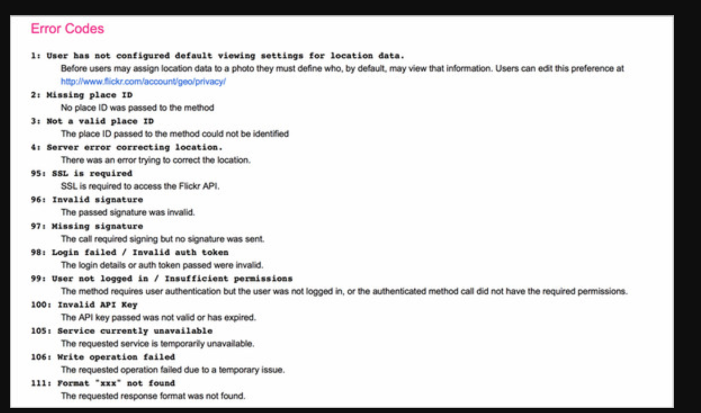

<!-- # Flicker example
Flickr call

RESTful call

GET /services/rest/?method=flickr.activity.userPhotos	 GET /services/rest/activity/userPhotos
POST /services/rest/?method=flickr.favorites.add	     POST/services/rest/favorites
POST /services/rest/?method=flickr.favorites.remove	     DELETE /services/rest/favorites/:id
POST /services/rest/?method=flickr.galleries.editPhoto	 PUT/services/rest/galleries/photo/:id

Flickr took a SOAP API—an API focused on actions, not resources—and tried to make it work in a more REST-like way, without the changes to the structure needed to make it work appropriately. That meant the API didn’t have a contract to tell developers how they were supposed to interact with the system—and no objects.
The Flickr API accepts only two methods: GET and POST. This means that it supports clients who are using limited frameworks, but it also means that a developer with the full methods available has to think carefully about which method to use for a call. Additionally, the URL isn’t used to describe the resource being accessed; rather, a method is called, and all calls are made to the same URL.

`https://api.flickr.com/services/rest/?method=flickr.test.echo&name=value`

Deleting a photo should be a DELETE to the photo resource, but instead Flickr uses the following call:

`https://api.flickr.com/services/rest/?method=flickr.photos.delete&photo_id=value`

Instead of using HTTP status codes, as is the usual pattern, Flickr is using an antipattern where a failed call returns a 2XX status code (indicating success) and

1. Don’t surprise your users
2. Don’t make me think
3. Focus on use cases
4. Documentation should tell a story

Ex

Exercise 1
Look for additional APIs that don’t follow standard rules. If you needed to develop an API that required nonstandard practices, how could you make it easier for

5.4. REST is not always best -->